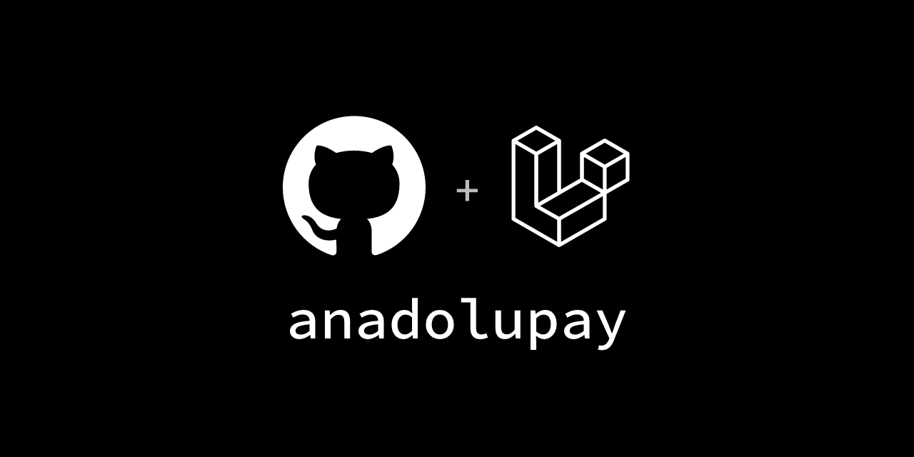

<p align="center">
  
</p>

# AnadoluPay

[](https://packagist.org/packages/voxyfy/anadolupay)
[](https://github.com/voxyfy/anadolupay/actions?query=workflow%3Arun-tests+branch%3Amain)
[](https://packagist.org/packages/voxyfy/anadolupay)

Türk bankalarının sanal POS'ları için tek arayüz.

Türkiye'de banka entegrasyonu yazmak, aynı işi on yedi kez farklı şekilde
yapmaktır. Garanti tutarı kuruş cinsinden tam sayı ister, NestPay ondalıklı
dizgi. Garanti hash'i ayraçsız birleştirip büyük harfe çevirir, NestPay alanları
sıralayıp `|` ile birleştirir, PosNet `;` kullanır. Kuveyt Türk size form
alanları değil hazır bir HTML sayfası döner. VakıfBank provizyon adımında kart
bilgisini bir daha ister. Bunların hiçbiri dokümantasyonda yan yana yazmaz;
her birini ayrı ayrı öğrenirsiniz.

Bu paket o farkları tek bir sözleşmenin arkasına alır:

```php
$response = AnadoluPay::driver('garanti')->createPayment($data);

return response($response->toHtmlForm());
```

Bankayı değiştirmek için `'garanti'` yerine `'akbank'` yazmak yeterlidir.

Çalışan bir örnek uygulama için:
**[Voxyfy/anadolupay-laravel](https://github.com/Voxyfy/anadolupay-laravel)**

**Ne yapmaz:** Arayüz üretmez, sipariş durumu tutmaz, stok düşmez, fatura
kesmez. Ödeme akışını yürütür ve yanıtı normalleştirir; gerisi sizin
uygulamanızın işi.

---

> ### Canlıya çıkmadan önce okuyun
>
> Bu paketteki protokoller bankaların public dokümantasyonuna göre yazıldı ve
> istek üretimi, imza ve yanıt eşlemesi birim testleriyle kilitlendi. **Ancak
> banka driver'larının çoğu gerçek bir bankaya karşı çalıştırılmadı.**
> (İstisna: NestPay ailesi Ziraat test terminalinde kısmen doğrulandı.)
>
> Testler benim yazdığım algoritmayı doğrular, bankanın beklediğini değil. Bir
> alanın sırası yanlışsa test yeşil kalır, banka işlemi reddeder. Kullanacağınız
> her banka için kendi test üye işyeri bilgilerinizle **en az bir 3D Secure satış
> ve bir iade** çalıştırın. Hash hesabında bankalar zaman zaman kuruluma özel
> farklılıklar tanımlıyor.
>
> Bu uyarı banka driver'ları içindir. **`iyzico` driver'ı bunun dışındadır:**
> sandbox ortamında uçtan uca çalıştırılıp doğrulanmıştır — bkz.
> [Doğrulama durumu](#doğrulama-durumu).

---

## Doğrulama durumu

Her driver aynı ölçüde doğrulanmış değil. Bu tablo hangisinin nereye kadar
ölçüldüğünü gösterir; "test var" ile "gerçekten çalışıyor" aynı şey değildir.

| Seviye | Ne anlama gelir |
|---|---|
| **Uçtan uca** | Sağlayıcının sandbox'ında gerçek bir ödeme tamamlandı |
| **Test vektörü** | İmza, sağlayıcının kendi yayınladığı vektörle birebir eşleşiyor |
| **Dokümana göre** | Protokol dokümandan uygulandı, sağlayıcıya karşı ölçülmedi |

| Driver | Seviye | Dayanak |
|---|---|---|
| `iyzico` | **Uçtan uca** | 2026-08-09, sandbox 3D Secure satış |
| `kuveytturk` | **Uçtan uca (ödeme)** | 2026-08-09 — 3D doğrulama ve provizyon (`OTORİZASYON VERİLDİ`); sorgu/iade doğrulanmadı |
| `craftgate` | Test vektörü | Resmî istemci depolarındaki üç vektör |
| `moka` | **Uçtan uca** | 2026-08-09, test servisinde 3D Secure satış tamamlandı |
| `tosla` | **Uçtan uca** | 2026-08-09 — 3D satış, durum, taksit, iade ve iptal doğrulandı |
| `paratika` | Dokümana göre | Vektör yayınlanmıyor |
| NestPay bankaları | **Uçtan uca** | 2026-08-09, Ziraat test terminali — 3D satış, durum, iade ve iptal |
| `vakifbank` (PayFlex) | **Uçtan uca** | 2026-08-10, banka sandbox'ı — 3D Secure satış tamamlandı; ayrıca non-3D satış, durum, iade (kısmî ve tam), iptal, ön provizyon ve kapama |
| Diğer banka driver'ları | Dokümana göre | Banka entegrasyon dokümanları |

### iyzico'da tam olarak ne doğrulandı

2026-08-09'da iyzico sandbox'ında, örnek projeden, tarayıcıyla tamamlanan bir
3D Secure satış (100,00 TL, tek çekim, resmî test kartı) şunları kanıtladı:

- **`Authorization` başlığı** (IYZWSv2) — iyzico isteği kabul etti, `paymentId` verdi
- **Initialize yanıt imzası** — doğrulama açıkken geçti
- **3DS dönüş imzası** — gerçek dönüş, `conversationData:conversationId:mdStatus:paymentId:status`
  sırasıyla birebir eşleşti
- **Provizyon (auth) yanıt imzası** — `/payment/3dsecure/auth` yanıtı doğrulandı,
  `authCode` alındı

Aynı oturumda şu işlemler de sandbox'a karşı çalıştırıldı:

| İşlem | Sonuç |
|---|---|
| Durum sorgusu | `paid`, 100,00 TL, maskeli kart — sipariş numarasıyla |
| Durum sorgusu (bulunamayan kayıt) | `found: false` / `unknown` — sessizce "ödendi" demiyor |
| BIN sorgusu | Akbank · `master_card` · `debit` |
| Taksit sorgusu | Debit kartta tek seçenek, kredi kartta 1/2/3/6/9/12 — taksit kart tipine ve işyeri anlaşmasına bağlı |
| İade (tutarsız) | **Kusur bulundu ve düzeltildi**: `price` gönderilmiyordu, iyzico `5004` ile reddediyordu |
| İade (düzeltme sonrası) | Başarılı — iade yanıt imzası da doğrulandı; iyzico işlemi `transactionType: CANCEL` olarak kaydetti |

Bunlar **doğrulanmadı**: diğer ödeme modelleri (`3d_pay`, `3d_host`,
`regular`) ve canlı ortam. Sandbox'ta çalışan bir akış canlıda da çalışır diye
bir garanti yoktur; üye işyeri tanımınız farklı olabilir.

**iyzico'nun ayrı bir iptal işlemi yoktur** — bu yüzden driver
`SupportsCancellation` arayüzünü uygulamaz. Aynı gün yapılan tam iadeyi iyzico
kendisi iptal olarak işler; yukarıdaki testte yanıt `transactionType: CANCEL`
döndü. Yani iptal etmek için `refund()` çağırmanız yeterli.

---

**İçindekiler**
[Kurulum](#kurulum) ·
[Doğrulama durumu](#doğrulama-durumu) ·
[Örnek proje](https://github.com/Voxyfy/anadolupay-laravel) ·
[Desteklenen bankalar](#desteklenen-bankalar) ·
[Nasıl çalışır](#nasıl-çalışır) ·
[Yapılandırma](#yapılandırma) ·
[Ödeme akışı](#ödeme-akışı) ·
[İade ve iptal](#iade-ve-iptal) ·
[Ödeme modelleri](#ödeme-modelleri) ·
[Yetenekler](#yetenekler) ·
[Tutarlar](#tutarlar) ·
[Bankaların tuhaflıkları](#bankaların-tuhaflıkları) ·
[Hata yönetimi](#hata-yönetimi-ve-yeniden-deneme) ·
[Event'ler](#eventler) ·
[Loglama](#loglama) ·
[Test ortamı](#test-ortamı) ·
[Test kartları](TEST-KARTLARI.md) ·
[Güvenlik](#güvenlik) ·
[Yeni banka eklemek](#yeni-banka-eklemek) ·
[Yol haritası](#yol-haritası)

## Kurulum

```bash
composer require voxyfy/anadolupay
php artisan vendor:publish --tag="anadolupay-config"
```

PHP 8.2+, Laravel 12 veya 13. Auto-discovery açıktır, ek adım yoktur.

> Laravel 13 en az PHP 8.3 ister; PHP 8.2 kullanıyorsanız Laravel 12'de
> kalırsınız. CI her iki kombinasyonu da koşar.

Uçtan uca kurulmuş bir Laravel projesi görmek isterseniz
[anadolupay-laravel](https://github.com/Voxyfy/anadolupay-laravel) deposu
ödeme başlatma, 3D dönüşü ve iade akışlarını örnekliyor.

## Desteklenen bankalar

Türkiye'deki sanal POS'lar birkaç ortak altyapı ailesine iner. Aynı aileyi
kullanan bankalar aynı driver'ı paylaşır; aralarındaki fark yalnızca uç nokta
ve kimlik bilgisidir.

| Driver | Banka | Altyapı | 3D | 3D Pay | 3D Host | Non-secure | İade | İptal |
|---|---|---|:-:|:-:|:-:|:-:|:-:|:-:|
| `akbank` | Akbank | Asseco / Payten | ✅ | ✅ | ✅ | ✅ | ✅ | ✅ |
| `isbank` | İş Bankası | Asseco / Payten | ✅ | ✅ | ✅ | ✅ | ✅ | ✅ |
| `ziraat` | Ziraat Bankası | Asseco / Payten | ✅ | ✅ | ✅ | ✅ | ✅ | ✅ |
| `halkbank` | Halkbank | Asseco / Payten | ✅ | ✅ | ✅ | ✅ | ✅ | ✅ |
| `qnb` | QNB Finansbank | Asseco / Payten | ✅ | ✅ | ✅ | ✅ | ✅ | ✅ |
| `teb` | TEB | Asseco / Payten | ✅ | ✅ | ✅ | ✅ | ✅ | ✅ |
| `sekerbank` | Şekerbank | Asseco / Payten | ✅ | ✅ | ✅ | ✅ | ✅ | ✅ |
| `ing` | ING | Asseco / Payten | ✅ | ✅ | ✅ | ✅ | ✅ | ✅ |
| `alternatifbank` | Alternatif Bank | Asseco / Payten | ✅ | ✅ | ✅ | ✅ | ✅ | ✅ |
| `turkiyefinans` | Türkiye Finans | Asseco / Payten | ✅ | ✅ | ✅ | ✅ | ✅ | ✅ |
| `garanti` | Garanti BBVA | GVPS | ✅ | ✅ | — | ✅ | ✅ | ✅ |
| `yapikredi` | Yapı Kredi | PosNet (XML) | ✅ | — | — | ✅ | ✅ | ✅ |
| `albaraka` | Albaraka Türk | PosNet V1 (JSON) | ✅ | — | ✅ | ✅ | ✅ | ✅ |
| `vakifbank` | VakıfBank | PayFlex V4 | ✅ | — | — | ✅ | ✅ | ✅ |
| `ziraat-payflex` | Ziraat Bankası | PayFlex V4 | ✅ | — | — | ✅ | ✅ | ✅ |
| `denizbank` | DenizBank | InterPos | ✅ | ✅ | ✅ | ✅ | ✅ | ✅ |
| `qnb-payfor` | QNB / Enpara | PayFor | ✅ | ✅ | ✅ | ✅ | ✅ | ✅ |
| `ziraat-katilim` | Ziraat Katılım | PayFor | ✅ | ✅ | ✅ | ✅ | ✅ | ✅ |
| `kuveytturk` | Kuveyt Türk | BOA / TDV2.0 | ✅ | — | — | ✅ | — | — |
| `vakif-katilim` | Vakıf Katılım | BOA | ✅ | — | ✅ | ✅ | ✅ | ✅ |

Ödeme kuruluşları:

| Driver | Kuruluş | 3D | 3D Pay | 3D Host | Non-secure | İade | İptal |
|---|---|:-:|:-:|:-:|:-:|:-:|:-:|
| `akbank-pos` | Akbank (yeni JSON API) | ✅ | ✅ | ✅ | ✅ | ✅ | ✅ |
| `paytr` | PayTR | — | ✅ | ✅ | ✅ | ✅ | — |
| `param` | Param | ✅ | ✅ | — | ✅ | ✅ | — |
| `tosla` | Tosla (AkÖde) | — | ✅ | ✅ | ✅ | ✅ | ✅ |
| `craftgate` | Craftgate | ✅ | — | — | ✅ | ✅ | — |
| `moka` | Moka United | ✅ | — | — | ✅ | ✅ | ✅ |
| `paratika` | Paratika (Payten) | ✅ | ✅ | ✅ | ✅ | ✅ | ✅ |
| `iyzico` | iyzico | ✅ | — | — | — | — | — |
| `fake` | geliştirme için sahte driver | — | — | — | ✅ | ✅ | — |

**Aynı bankanın iki driver'ı varsa** ikisi de gerçektir; hangisinin
tanımlandığını sanal POS sözleşmenizden teyit edin:

- Akbank → `akbank` (eski NestPay) veya `akbank-pos` (yeni JSON API)
- Ziraat → `ziraat` (NestPay) veya `ziraat-payflex` (PayFlex)
- QNB Finansbank → `qnb` (NestPay) veya `qnb-payfor` (PayFor)

## Nasıl çalışır

Bankalar arasındaki fark yüzeyde protokol (XML / JSON / SOAP / form), derinde
imza algoritmasıdır. Paket bu iki katmanı ayırır:

```
CreatePaymentData ─┐
                   ├─► AnadoluPay::driver('garanti')
CardData ──────────┘            │
                                ▼
                  ┌─────────────────────────────┐
                  │   AbstractBankGateway       │  ortak akış:
                  │   createPayment / verify    │  form → hash → provizyon
                  │   refund                    │
                  └──────────────┬──────────────┘
                                 │  banka-özel eşleme
          ┌──────────────────────┼──────────────────────┐
          ▼                      ▼                      ▼
   AssecoGateway          GarantiGateway         PosNetGateway   … (16 driver)
   sha512 + '|'           sha512 UPPER           sha256 + ';'
   CC5Request XML         GVPSRequest XML        posnetRequest XML
          │                      │                      │
          └──────────────────────┼──────────────────────┘
                                 ▼
                        BankHttpClient
              XML/JSON/form kodlama · maskeli loglama
```

Bir driver yalnızca yedi metodu doldurur: `build3dFormFields()`,
`checkCallbackHash()`, `is3dAuthSuccess()`, `provision()`,
`mapCallbackResponse()`, `mapProvisionResponse()`, `extractOrderId()`.

Akış kontrolü, hata yönetimi, HTTP ve loglama temel sınıfta tek yerde durur.
Bir bankada düzeltilen akış hatası hepsinde düzelir; bu, on yedi kopyanın
ayrı ayrı bakımını yapmaktan farkı.

Dönen `PaymentResponse` ve `VerificationResponse` bankadan bağımsızdır: hangi
driver'ı kullanırsanız kullanın `success`, `paymentId` ve `status` aynı anlama
gelir. Bankanın ham yanıtı `raw` içinde korunur — normalleştirme bilgi kaybı
yaratmaz.

## Yapılandırma

Yalnızca kullandığınız bankanın değişkenlerini doldurun. Diğer preset'ler boş
kalabilir; yalnızca çağrıldıklarında hata verirler.

Aynı kavramın bankalarda farklı adları var:

| Config | Bankadaki karşılığı |
|---|---|
| `merchant_id` | ClientId · MerchantId · ShopCode · merchantSafeId |
| `terminal_id` | TerminalId · TerminalNo · terminalSafeId |
| `username` | Name · UserCode · ProvUserID |
| `password` | API şifresi |
| `secret_key` | store key · hash key · GUID (3D anahtarı) |

```env
# Garanti BBVA
GARANTI_MERCHANT_ID=xxxxxxx
GARANTI_TERMINAL_ID=30690000
GARANTI_USERNAME=PROVAUT
GARANTI_PASSWORD=xxxxxxx
GARANTI_SECRET_KEY=xxxxxxx
GARANTI_REFUND_USERNAME=PROVRFN      # iade/iptal ayrı kullanıcı ister
GARANTI_REFUND_PASSWORD=xxxxxxx

# Akbank (NestPay)
AKBANK_MERCHANT_ID=xxxxxxx
AKBANK_USERNAME=xxxxxxx
AKBANK_PASSWORD=xxxxxxx
AKBANK_SECRET_KEY=xxxxxxx

# Yapı Kredi PosNet — posnet_id ayrı bir alandır, merchant_id değildir
YAPIKREDI_MERCHANT_ID=xxxxxxx
YAPIKREDI_TERMINAL_ID=xxxxxxx
YAPIKREDI_POSNET_ID=xxxxxxx
YAPIKREDI_SECRET_KEY=xxxxxxx
```

Tüm anahtarlar için yayınladığınız `config/anadolupay.php` dosyasına bakın.

## Ödeme akışı

Türk banka sanal POS'larında 3D Secure bir GET yönlendirmesi değil, bankanın
3D geçidine yapılan bir **form POST**'udur. Akış üç adımdır:

```
  [1] createPayment()          [2] tarayıcı            [3] verify()
      imzalı form üret    ──►   bankaya POST      ──►   hash doğrula
                                kullanıcı SMS/          + provizyon iste
                                app onayı
```

### 1 · Ödemeyi başlat

```php
use Voxyfy\AnadoluPay\DTO\CardData;
use Voxyfy\AnadoluPay\DTO\CreatePaymentData;
use Voxyfy\AnadoluPay\Facades\AnadoluPay;

$data = new CreatePaymentData(
    amount: 199.90,
    currency: 'TRY',
    orderId: 'SIPARIS-123',
    customer: [
        'name'  => 'Ahmet Yılmaz',
        'email' => 'ahmet@example.com',
        'phone' => '5551112233',
    ],
    successUrl: route('odeme.donus'),
    failUrl: route('odeme.donus'),
    card: new CardData(
        number: '5528790000000008',
        expireMonth: '12',
        expireYear: '2030',
        cvv: '123',
        holderName: 'Ahmet Yılmaz',
    ),
    installment: 1,
    paymentModel: CreatePaymentData::MODEL_3D_SECURE,
    ip: $request->ip(),
);

$response = AnadoluPay::driver('garanti')->createPayment($data);

return response($response->toHtmlForm());
```

`toHtmlForm()` otomatik gönderilen bir sayfa üretir. Formu kendiniz render
etmek isterseniz:

```php
$response->formAction;   // bankanın 3D geçidi
$response->formMethod;   // 'POST'
$response->formFields;   // imzalı gizli alanlar
```

**Kuveyt Türk, Vakıf Katılım ve Param** form alanı yerine hazır bir HTML sayfası
döner; bu durumda `formFields` boştur ve içerik `$response->htmlContent`
içindedir. `toHtmlForm()` iki durumu da doğru ele alır — elle uğraşmak yerine
onu kullanın.

### 2 · Dönüşü doğrula

```php
use Voxyfy\AnadoluPay\DTO\VerifyPaymentData;

$result = AnadoluPay::driver('garanti')->verify(new VerifyPaymentData(
    payload: $request->all(),
    headers: $request->headers->all(),
    rawBody: $request->getContent(),
));

if ($result->success) {
    // $result->paymentId bankanın işlem referansıdır.
    // Saklayın — iade ve iptal için gerekecek.
}
```

`verify()` sırayla: dönüş hash'ini doğrular (eşleşmezse
`InvalidSignatureException`), 3D doğrulama durumunu kontrol eder, klasik 3D
Secure modelinde bankaya provizyon isteğini gönderir. 3D Pay ve 3D Host'ta
provizyon banka tarafında tamamlandığı için ikinci istek atılmaz.

**PayFlex (VakıfBank / Ziraat) sipariş bağlamı ister.** Banka provizyon
adımında kart bilgisini ve tutarı yeniden sorar ama bunları dönüşte
göndermez — siz sağlarsınız:

```php
$result = AnadoluPay::driver('vakifbank')->verify(new VerifyPaymentData(
    payload: $request->all(),
    order: [
        'id'       => 'SIPARIS-123',
        'amount'   => 199.90,
        'currency' => 'TRY',
        'ip'       => $request->ip(),
        'card'     => ['number' => '...', 'expire_month' => '12',
                       'expire_year' => '30', 'cvv' => '123'],
    ],
));
```

## İade ve iptal

```php
use Voxyfy\AnadoluPay\DTO\RefundPaymentData;

AnadoluPay::driver('akbank')->refund(new RefundPaymentData('SIPARIS-123'));         // tam
AnadoluPay::driver('akbank')->refund(new RefundPaymentData('SIPARIS-123', 49.90));  // kısmi
```

Gün sonu kapanmadan önce iade değil **iptal** kullanın — daha hızlı ve
komisyonsuzdur:

```php
AnadoluPay::driver('akbank')->cancel(new RefundPaymentData('SIPARIS-123'));
```

Bazı bankalar işlemi sipariş numarasıyla değil, kendi referanslarıyla eşler.
Bu referansı ödeme sırasında saklayıp `metadata` ile geçin:

| Banka | Gereken alan | Nereden gelir |
|---|---|---|
| Garanti | `ref_ret_num` | provizyon yanıtı `Transaction.RetrefNum` |
| Yapı Kredi | `host_ref_num` | provizyon yanıtı `hostlogkey` |
| PayFlex | `transaction_id` | provizyon yanıtı `TransactionId` |
| Vakıf Katılım | `remote_order_id` | provizyon yanıtı `OrderId` |

```php
new RefundPaymentData('SIPARIS-123', 49.90, metadata: ['ref_ret_num' => '...']);
```

> `cancel()` ve `status()` şu an `PaymentGatewayInterface`'de değil, driver'lara
> özel metotlardır. Yani statik tip güvenliği yoktur; desteklemeyen bir
> driver'da çağırırsanız runtime'da patlar. Hangi driver'ın hangisini
> desteklediği [tabloda](#desteklenen-bankalar) yazıyor.

## Ödeme modelleri

| Sabit | Ne yapar | Ne zaman |
|---|---|---|
| `MODEL_3D_SECURE` | Doğrulama sonrası ayrı provizyon isteği | Varsayılan; en yaygın |
| `MODEL_3D_PAY` | Doğrulama ve provizyon tek adımda bankada | Daha az round-trip isteyen kurulumlar |
| `MODEL_3D_HOST` | Kart formu da bankada toplanır | **Kart verisi sunucunuza hiç uğramaz** — PCI kapsamını daraltır |
| `MODEL_NON_SECURE` | 3D yok, doğrudan provizyon | Mail order / abonelik |

3D Host modelinde `card` vermeniz gerekmez.

## Yetenekler

Her banka her işlemi sunmaz. Bu bir eksiklik değil, sağlayıcı sınırıdır:
PayTR iptal (void) API'si sunmaz, Akbank'ın yeni API'si tekil durum sorgusu
sunmaz, Kuveyt Türk ön provizyon sunmaz.

Paket bunu tip düzeyinde bildirir — desteklenmeyen bir metodu çağırmadan
önce `instanceof` ile kontrol edin:

```php
use Voxyfy\AnadoluPay\Contracts\SupportsStatusQuery;

$gateway = AnadoluPay::driver('garanti');

if ($gateway instanceof SupportsStatusQuery) {
    $status = $gateway->status('SIPARIS-123');
}
```

| Driver | Durum | İptal | Ön prov. | Geçmiş | BIN | Taksit | Tekrar |
|---|:-:|:-:|:-:|:-:|:-:|:-:|:-:|
| `akbank`, `isbank`, `ziraat`, `halkbank`, `qnb`, `teb`, `sekerbank`, `ing`, `alternatifbank`, `turkiyefinans` | ✅ | ✅ | ✅ | ✅ | — | — | ✅ |
| `garanti` | ✅ | ✅ | ✅ | ✅ | ✅ | — | ✅ |
| `yapikredi`, `albaraka` | ✅ | ✅ | ✅ | — | — | — | — |
| `vakifbank`, `ziraat-payflex` | ✅ | ✅ | ✅ | — | — | — | ✅ |
| `denizbank` | ✅ | ✅ | ✅ | — | — | — | — |
| `qnb-payfor`, `ziraat-katilim` | ✅ | ✅ | ✅ | ✅ | — | — | — |
| `kuveytturk` | ✅ | ✅ | — | — | — | — | — |
| `vakif-katilim` | ✅ | ✅ | ✅ | ✅ | — | — | — |
| `akbank-pos` | — | ✅ | ✅ | ✅ | — | — | ✅ |
| `paytr` | ✅ | — | — | — | ✅ | ✅ | — |
| `param` | ✅ | ✅ | ✅ | — | — | — | — |
| `tosla` | ✅ | ✅ | ✅ | ✅ | — | ✅ | — |
| `craftgate` | ✅ | — | ✅ | ✅ | ✅ | ✅ | — |
| `moka` | ✅ | ✅ | ✅ | ✅ | ✅ | — | — |
| `paratika` | ✅ | ✅ | ✅ | ✅ | ✅ | ✅ | — |
| `iyzico` | ✅ | — | — | — | ✅ | ✅ | — |

Arayüzler: `SupportsStatusQuery`, `SupportsCancellation`,
`SupportsPreAuthorization`, `SupportsOrderHistory`, `SupportsBinQuery`,
`SupportsInstallmentQuery`, `SupportsRecurringPayments`.

### Durum sorgusu

Zaman aşımı gibi belirsiz durumları kapatmanın tek yolu budur.

```php
$status = AnadoluPay::driver('garanti')->status('SIPARIS-123');

$status->found;        // banka bu siparişi tanıyor mu
$status->isPaid();     // para tahsil edildi mi
$status->isPending();  // 3D doğrulaması bekleniyor
$status->amount;       // Money
$status->refundedAmount;
```

Bankaların birbirine benzemeyen durum kodları (`A`, `1`, `SUCCESS`,
`Başarılı`) tek bir sözlüğe indirgenir. Tanınmayan bir kod **`unknown`**
döner — sessizce "başarılı" sayılmaz.

Ön provizyon `isPaid()` için `false` döndürür: tutar bloke edilmiştir ama
tahsil edilmemiştir.

### Ön provizyon

```php
$gateway = AnadoluPay::driver('garanti');

// Bloke et
$response = $gateway->preAuthorize($data);

// Nihai tutar belli olunca tahsil et
$gateway->capture(new CapturePaymentData(
    orderId: 'SIPARIS-123',
    amount: 149.90,                          // blokeden küçük olabilir
    metadata: ['ref_ret_num' => '...'],      // Garanti bu referansı ister
));
```

Bloke süresiz değildir; bankaya göre 1-30 gün içinde kapatılmazsa düşer.

### Taksit ve BIN

```php
$bin = AnadoluPay::driver('iyzico')->binLookup('415565');
$bin->bankName;   // "Garanti BBVA"
$bin->isCredit();

$options = AnadoluPay::driver('paytr')->installmentOptions(
    Money::fromMinorUnits(19990),
);

foreach ($options as $option) {
    $option->count;         // 3
    $option->totalPrice;    // Money — komisyon dâhil
    $option->monthlyPrice;
}
```

BIN sorgusuna kart numarasının **tamamını göndermeyin**; ilk 6-8 hane yeter.

### Tekrarlayan ödeme

Plan ilk ödemeyle birlikte bankaya bildirilir; sonraki çekimleri banka
kendisi başlatır.

```php
new CreatePaymentData(
    amount: 49.90,
    // …
    metadata: ['recurring' => new RecurringPlan(
        interval: 1,
        frequency: RecurringPlan::FREQUENCY_MONTH,
        paymentCount: 12,
    )],
);
```

Desteklenen frekanslar bankaya göre değişir — Garanti yıllık, PayFlex
haftalık tekrar sunmaz. `supportedRecurringFrequencies()` ile sorgulayın;
desteklenmeyen bir frekans `PaymentFailedException` fırlatır.

## Tutarlar

Tutarlar paket içinde her zaman **kuruş cinsinden tam sayı** olarak taşınır.
`0.1 + 0.2 !== 0.3` olduğu için float ile hesaplanan bir tutar imzaya giren
dizgiyi bir kuruş kaydırabilir ve banka işlemi reddeder.

```php
use Voxyfy\AnadoluPay\Support\Money;

new CreatePaymentData(amount: Money::fromMinorUnits(19990), ...);  // 199,90 TL
new CreatePaymentData(amount: 199.90, ...);                        // eşdeğer
```

`float` vermek çalışmaya devam eder — iki ondalık haneye yuvarlanıp kuruşa
çevrilir. Tutarı zaten kuruş olarak tutuyorsanız (veritabanında `int` kolon
gibi) `Money::fromMinorUnits()` kesinlik kaybı olmayan tek yoldur.

Driver'lar tutara yalnızca `$data->money()` üzerinden erişir ve bankanın
istediği biçime orada çevirir:

| | Örnek (199,90 TL) | Kullanan |
|---|---|---|
| `toMinorUnitsString()` | `"19990"` | Garanti, PosNet, Kuveyt Türk, Tosla |
| `toDecimalString()` | `"199.90"` | Akbank POS, PayFlex, iyzico |
| `toNaturalString()` | `"199.9"` | NestPay, PayFor, InterPos |

## Bankaların tuhaflıkları

Driver'lar bunları sizin için hallediyor. Burada olmalarının sebebi, bir şey
ters gittiğinde nereye bakacağınızı bilmeniz.

**Tutar formatı üç farklı.** Garanti, PosNet, Kuveyt Türk ve Tosla kuruş
cinsinden tam sayı ister (`199.90` → `19990`). NestPay ve PayFor PHP'nin doğal
float gösterimini ister (`199.9` → `"199.9"`, `100.0` → `"100"`). Akbank POS ve
PayFlex iki ondalıklı dizgi ister (`"199.90"`). **Hash tam olarak gönderilen
dizgi üzerinden hesaplandığı için bu formatlar değiştirilemez.**

**Taksit alanı tek çekimde bile dört farklı.** NestPay boş dizgi, PosNet `'00'`,
PayFor ve Kuveyt Türk `'0'`, Param `'1'` bekler. PayFlex alanı hiç göndermez.

**Para birimi kodu her yerde ISO 4217 sayısal değil.** Kuveyt Türk dört haneli
kullanır (`0949`), PosNet V1 harf kısaltması (`TL`, `US`, `EU`).

**PayFlex'te enrollment adımı diğer uçlardan ayrışır.** Provizyon ve sorgu
istekleri `prmstr` alanında URL-kodlanmış XML ister; enrollment ise **düz form
alanı** bekler. XML gönderilirse banka alanları hiç okumadan yanıltıcı bir
`2030 Invalid expire date` döndürür. Son kullanma tarihi de iki biçimdedir:
enrollment `YYMM`, provizyon `YYYYMM`.

**PayFlex 3D'de `PaReq` her zaman klasik bir 3DS bloğu değildir.** BKM "GO
Güvenli Öde" kurulumunda base64'ü, kendi kendini gönderen bir HTML sayfasıdır ve
doğrulama sayfası `ACSUrl`'de değil o sayfanın form hedefindedir; `ACSUrl`'e
POST edilirse banka "400 Hatalı İstek" sayfası verir. Driver bunu ayırt eder.

**PayFlex 3D provizyonu kart bilgisi istemez.** Banka işlemi `MpiTransactionId`
üzerinden bulur; bazı kurulumlar kart gönderilmesini `1127` ile reddeder. Bu
yüzden `verify()` çağrısında `order['card']` isteğe bağlıdır — vermezseniz kart
alanları hiç gönderilmez ve PAN'ı istekler arasında saklamanız gerekmez.

**PayFlex durum sorgusu tek bir durum alanı döndürmez.** `IsCanceled`,
`IsReversed`, `IsRefunded`, `TotalRefundAmount` ve `IsCaptured` bayraklarından
türetilir. Kısmî iade edilmiş bir işlem `paid` kalır; `refunded` yalnızca tamamı
iade edildiğinde döner.

**Garanti iade için ayrı kullanıcı ister.** `refund` ve `void` işlemlerinde
`securityData` normal şifreyle değil iade şifresiyle hesaplanır. İki ayrı
kullanıcı tanımlamazsanız iadeler reddedilir.

**PosNet üç sunucu isteği yapar.** Önce `oosRequestData` ile veri paketleri
alınır, sonra 3D geçidine POST edilir, dönüşte `oosResolveMerchantData` ile
çözülüp `oosTranData` ile provizyon tamamlanır. Sipariş numarası 20 haneye
sıfırla doldurulur; iade/iptalde 24 hane olur ve 3D siparişler `TDSC` ön eki
alır.

**Ziraat Katılım'ın dönüş hash'i banka tarafında tutarsız üretiliyor.** Bu
yüzden o preset'te `verify_hash` varsayılan olarak kapalıdır. Bankanız
düzelttiyse `ZIRAAT_KATILIM_VERIFY_HASH=true` yapın.

**PayTR ve Moka bildirimi `OK` yanıtı bekler.** Webhook'unuz gövdede düz metin
`OK` döndürmezse bildirim tekrar tekrar gönderilir (Moka iki kez daha dener).

**Paratika iki hash alanı döndürür ve biri kullanımdan kalkmıştır.**
`SD_SHA512` örnek yanıtlarda önce görünür ama dokümanda "Do not use!"
işaretlidir; doğrusu `sdSha512`dir. Ayrıca durum sorgusu bir sipariş için
**tüm** işlemleri döndürür; sadece satış kaydına bakarsanız iade edilmiş
sipariş "ödendi" görünür.

**Tosla zaman damgasını Türkiye saatinde ister.** `timeSpan` GMT+3'te ve
en fazla 1 saat farkla kabul edilir. UTC'de çalışan bir uygulamada damga üç
saat geride kalır ve her istek `998 Validasyon Hatası` alır — mesaj sebebi
söylemez. Paket damgayı `Europe/Istanbul` üretir.

**Moka'da üç ayrı kimlik vardır ve birbirinin yerine geçmezler:**

| Alan | Nedir | Nerede kullanılır |
|---|---|---|
| `OtherTrxCode` | Sizin sipariş numaranız | durum sorgusu, iptal, iade |
| `VirtualPosOrderId` / `trxCode` | Moka'nın işlem kodu (3D dönüşünde gelir) | iptal, iade |
| `DealerPaymentId` | Moka'nın sayısal ödeme kaydı | yalnızca detay sorgusu |

Paket verdiğiniz değeri **sipariş numaranız** sayar; Moka'nın kendi kodunu
kullanacaksanız `metadata['virtual_pos_order_id']` ile bildirin. Biçime bakarak
tahmin edilmez: kod dokümanda `ORDER-…` görünse de gerçek bir bayide
`Test-df91b14d-…` biçiminde geldi.

Durum sorgusundan dönen `paymentId` **`DealerPaymentId`**'dir; onu iptal veya
iadeye verirseniz `PaymentNotFound` alırsınız.

**Moka'da durum sorgusu ödeme numarasını değil sipariş numaranızı ister.**
`GetDealerPaymentTrxDetailList` ucu `OtherTrxCode` (sizin sipariş numaranız)
ya da `PaymentId` (Moka'nın sayısal kaydı) kabul eder. Dönüşteki `trxCode`
bunların hiçbiri değildir — iptal ve iade için kullanılır.

**Moka'da her banka her bayide tanımlı değildir.** Sanal POS'u tanımlanmamış
bir bankanın kartıyla ödeme başlatırsanız `VirtualPosNotAvailable` alırsınız.
Hata kartın bankasıyla ilgilidir — tutar veya taksit değiştirmek çözmez.

**Moka'da BIN sorgusu farklı bir sarmalayıcı ister.** Diğer servisler
`PaymentDealerRequest`, BIN sorgusu `BankCardInformationRequest` bekler.
Paket bunu kendisi ayırır; kendi isteğinizi yazıyorsanız dikkat edin.

**Moka başarıyı ayrı bir alanda söylemez.** 3D dönüşündeki `resultCode`
başarılı işlemlerde boş gelir; sonuç `hashValue` içindedir. Ödeme başlatılırken
dönen `CodeForHash` saklanmazsa dönüş yorumlanamaz.

**Param IP kısıtı uygular ve eski test adresi kapandı.** `posws` ve
`testposws` sunucuları whitelist dışındaki adreslerden gelen isteği WAF
seviyesinde `403` ile reddeder — yani kimlik bilgileriniz doğru olsa bile
sunucunuzun IP'si Param'a bildirilmeden hiçbir çağrı geçmez. Ayrıca çok
sayıda kaynakta geçen `test-dmz.param.com.tr` adresi artık `404` dönüyor;
güncel test adresi `testposws.param.com.tr`'dir.

**Craftgate iki ayrı anahtar kullanır.** API istekleri Secret Key ile,
3D dönüşü panelde ayrıca üretilen **3D Secure Callback Key** ile imzalanır.
İkisini karıştırmak "imza geçersiz" hatası verir. Webhook'ların üçüncü bir
anahtarı vardır (Merchant Hook Key).

**Craftgate'te ödeme formu POST edilmez.** `3ds-init` ucu hazır bir HTML
sayfası döner; `PaymentResponse::$htmlContent` içinde gelir ve doğrudan
tarayıcıya basılır. Ayrıca kısmi iade ödeme değil **işlem** bazındadır:
`metadata['payment_transaction_id']` vermezseniz paket sessizce tam iade
yapmak yerine hata verir.

**Taşıma hatalarında iki ayrı soru vardır.** `safeToRetry` isteğin bankaya
ulaşmadığından emin miyiz, `outcomeUncertain` ise işlemin gerçekleşmiş olma
ihtimali var mı demektir. Banka isteği okumadan reddettiyse (4xx) sonuç
kesindir — hiçbir şey olmamıştır; zaman aşımı ve 5xx'te ise durum sorgusuyla
teyit gerekir.

**Kuveyt Türk'te sorgu ve iade ayrı bir SOAP servisindedir.** Ödeme ve
provizyon XML uçlarına giderken durum sorgusu, iade ve iptal
`VirtualPosService.svc/Basic` adresine gider. Bu uç JSON gövdeyi `415` ile
reddeder ve paketin bu bölümü **henüz doğrulanmamıştır**. Ayrıca `query_api`
tanımlanmazsa varsayılan canlı adrestir — test terminaliyle çalışırken mutlaka
test adresini verin.

**NestPay sorgu yanıtında tutarlar kuruş cinsindendir.** Birleşik
`ORDERSTATUS` alanındaki `ORIG_TRANS_AMT` ve `CAPTURE_AMT` kuruştur; ondalık
sanılırsa tutar yüz katı raporlanır. Paket bunu ayırır.

**NestPay dönüşünde boş alanlar `null` olmamalı.** Banka boş alanları hash'e
boş dizgi olarak katar. Laravel'in varsayılan `ConvertEmptyStringsToNull`
middleware'i bunları `null` yapar; paket `null`'ı boş dizgi sayarak bunu
telafi eder. Dönüş yükünü kendiniz işliyorsanız aynı kurala uyun, yoksa imza
hiçbir zaman tutmaz.

**Bankanın dönüş POST'u siteler arasıdır.** `SameSite=lax` çerezi bu istekte
gönderilmez; dönüşte oturum boş gelir. Sipariş bağlamını oturumda değil,
`okUrl`in sorgu dizgisinde taşıyın. Doğrulamaya yalnızca POST gövdesini verin —
sorgu parametreleri bankanın imzasına dâhil değildir.

**NestPay hash'i alanları sıralar.** Alanlar doğal sırada (harf duyarsız)
sıralanır, `hash`/`encoding`/`nationalidno` çıkarılır, sona secret key eklenir,
`|` ve `\` karakterleri kaçırılır. Forma yeni bir alan eklerseniz hash'e de
girer — banka bunu bilmiyorsa işlem reddedilir.

## Hata yönetimi ve yeniden deneme

Ödeme entegrasyonlarında en tehlikeli hata, **belirsiz** olandır. Banka
"reddettim" derse ne yapacağınız bellidir; ama istek zaman aşımına uğradığında
paranın çekilip çekilmediğini bilmezsiniz. Paket bu ikisini tip düzeyinde ayırır:

```
AnadoluPayException
├── PaymentFailedException        kesin: banka isteği aldı ve reddetti
├── InvalidSignatureException     imza tutmadı — sahte callback olabilir
├── DuplicatePaymentException     aynı sipariş için ikinci deneme
├── UnsupportedOperationException driver bu işlemi desteklemiyor
├── DriverNotFoundException       yapılandırma hatası
└── TransportException            BELİRSİZ: istek ulaştı mı, işlendi mi?
    ├── GatewayUnreachableException   bağlantı kurulamadı / zaman aşımı
    └── GatewayHttpException          2xx dışı yanıt veya çözümlenemeyen gövde
```

`TransportException` yakaladığınızda ödemeyi başarısız saymayın — durumu
banka üzerinden sorgulayın veya müşteriye "işleminiz kontrol ediliyor" deyin.

```php
use Voxyfy\AnadoluPay\Exceptions\PaymentFailedException;
use Voxyfy\AnadoluPay\Exceptions\TransportException;

try {
    $result = AnadoluPay::driver('garanti')->verify($data);
} catch (PaymentFailedException $e) {
    // Kesin ret: siparişi iptal edebilirsiniz.
} catch (TransportException $e) {
    // Belirsiz: siparişi "beklemede" bırakın, durum sorgusuyla teyit edin.
    $e->safeToRetry;  // yalnızca isteğin bankaya ulaşmadığı kesinse true
}
```

### Yeniden deneme

```env
ANADOLUPAY_RETRY_TIMES=2
ANADOLUPAY_RETRY_SLEEP_MS=250
```

Retry **yalnızca bankaya ulaşılamayan** durumlarda yapılır: bağlantı
reddedildi, DNS çözülemedi, TLS kurulamadı. Bu hatalarda isteğin bankaya
varmadığı bilinir.

**Zaman aşımı ve HTTP hataları tekrar denenmez.** Her ikisinde de istek bankaya
ulaşmış ve işlenmiş olabilir; körlemesine ikinci bir ödeme isteği göndermek
çift çekim demektir. Bu davranış testle kilitlidir.

Varsayılan `0`dır — yani retry kapalıdır. Açmadan önce sipariş durumunu kendi
tarafınızda takip ettiğinizden emin olun.

## Event'ler

Ödeme akışının dört noktasında event yayınlanır. **Hiçbiri kart verisi
taşımaz**, çünkü dinleyicilerin çoğu bu veriyi loglar veya kuyruğa yazar.

| Event | Ne zaman | Taşıdığı |
|---|---|---|
| `PaymentInitiated` | müşteri bankaya yönlendirilmeden önce | driver, orderId, `Money`, model, taksit |
| `PaymentVerified` | dönüş doğrulanıp provizyon tamamlanınca | driver, orderId, paymentId, success, status |
| `PaymentFailed` | akış bir istisnayla kesilince | driver, orderId, reason, exception |
| `RefundIssued` | iade isteği gönderilince | driver, paymentId, `Money`, refundId, success |

```php
Event::listen(PaymentVerified::class, function (PaymentVerified $event) {
    if ($event->success) {
        Order::where('code', $event->orderId)->update([
            'status' => 'paid',
            'payment_reference' => $event->paymentId,
        ]);
    }
});
```

`PaymentVerified` `success: false` ile de gelebilir — bu, doğrulama akışının
hatasız tamamlandığı ama ödemenin alınmadığı anlamına gelir. `PaymentFailed`
ise akışın kesildiği durumdur; istisna yutulmaz, event'ten sonra yukarı çıkar.

`ANADOLUPAY_EVENTS=false` ile kapatılabilir.

## Mükerrer ödeme koruması

```env
ANADOLUPAY_IDEMPOTENCY=true
ANADOLUPAY_IDEMPOTENCY_TTL=30
```

Aynı sipariş numarası için pencere içinde ikinci bir `createPayment()`
çağrısı `DuplicatePaymentException` fırlatır. Asıl hedef kullanıcının "Öde"
düğmesine iki kez basmasıdır.

Pencere bilinçli olarak kısadır (varsayılan 30 sn): ödeme gerçekten başarısız
olduğunda müşterinin aynı sipariş numarasıyla tekrar denemesi meşrudur.
Başlatma isteği hata alırsa kilit hemen bırakılır.

Kilit `Cache::add()` ile alınır — atomiktir, yani iki eşzamanlı istekten
yalnızca biri geçer. Bunun çalışması için `array` dışında bir cache sürücüsü
(redis, memcached, database) gerekir.

> Bu bir kolaylıktır, kesin garanti değildir. Mükerrer çekime karşı asıl
> savunma, siparişin durumunu kendi veritabanınızda tutmak ve ödemesi alınmış
> siparişler için akışı hiç başlatmamaktır.

## Loglama

Banka bir işlemi reddettiğinde size yalnızca bir kod döner
(`ProcReturnCode=99`). Sorunun hangi alanda olduğunu ancak gönderdiğiniz
gövdeyi görerek anlarsınız. Entegrasyon geliştirirken açın:

```env
ANADOLUPAY_LOGGING=true
ANADOLUPAY_LOG_CHANNEL=anadolupay   # boşsa uygulamanın varsayılan kanalı
```

```
[debug] AnadoluPay banka isteği  {"bank":"garanti","url":"…","body":"<GVPSRequest>…
                                  <Number>415565******6111</Number>
                                  <CVV2>[gizlendi]</CVV2>…"}
[debug] AnadoluPay banka yanıtı  {"bank":"garanti","status":200,"duration_ms":412,…}
```

Maskeleme iki katmanlıdır. Birincisi alan adına göre (`cvv`, `password`,
`secret_key`…). İkincisi değerin biçimine göre: **Luhn kontrolünden geçen her
13–19 haneli sayı, alan adı ne olursa olsun maskelenir.** İkinci katman
olmadan, on altı driver'ın farklı adlandırdığı kart alanlarından birini
gözden kaçırmak kart verisini loga düşürürdü.

Luhn kontrolü yanlış pozitifleri de eler — PosNet'in 20 haneye doldurulmuş
sipariş numaraları ve NestPay'in MD taşıyan `Number` alanı okunabilir kalır.

Başarısız HTTP yanıtları `warning`, gerisi `debug` seviyesindedir.

> Loglama **varsayılan olarak kapalıdır**. Maskeleme uygulansa bile bu
> kayıtların nereye yazıldığı bilinçli bir tercih olmalıdır: kalıcı bir kanal
> seçiyorsanız erişimini kısıtlayın ve saklama süresi tanımlayın.

## iyzico

iyzico bankalardan iki noktada ayrılır ve paket ikisini de sizin yerinize
halleder:

- 3D adımında form alanı değil, base64 kodlanmış hazır bir HTML sayfası döner.
  Paket bunu çözer; `toHtmlForm()` doğrudan basılabilir HTML verir.
- Her yanıt, callback ve webhook ayrı bir imza şeması kullanır. Üçü de
  HMAC-SHA256 üretir ve sonucu **onaltılık** kodlar:

| İmza | Nerede | İmzalanan |
|---|---|---|
| `Authorization` | istek başlığı | `randomKey + uriPath + gövde` → `IYZWSv2 base64(apiKey:…&randomKey:…&signature:…)` |
| Yanıt / callback | gövdedeki `signature` | uca göre değişen alanlar, `:` ayraçlı |
| Webhook | `X-IYZ-SIGNATURE-V3` başlığı | `secretKey + eventType + …`, ayraçsız |

Yanıt imzasında alan sırası uca göre sabittir; örneğin 3DS callback'i
`conversationData:conversationId:mdStatus:paymentId:status` sırasını kullanır.
Tutarlardaki sondaki sıfırlar imzadan önce atılır (`10.50` → `10.5`).

```env
IYZICO_API_KEY=xxx
IYZICO_SECRET_KEY=xxx
IYZICO_BASE_URL=https://sandbox-api.iyzipay.com
IYZICO_CALLBACK_URL=https://shop.test/anadolupay/webhook/iyzico
```

İade `/v2/payment/refund` ucundan yapılır:

```php
AnadoluPay::driver('iyzico')->refund(new RefundPaymentData(
    paymentId: '12345',
    amount: 49.90,
    metadata: ['conversation_id' => 'SIPARIS-123'],
));
```

**iyzico'da tutar zorunludur.** Diğer driver'larda tutarı boş bırakmak
"tamamını iade et" demektir; iyzico'da böyle bir uç yoktur ve tutarsız istek
`5004 price gönderilmesi zorunludur` ile reddedilir. Paket bu durumda ödemenin
tutarını `/payment/detail` ucundan okuyup gönderir — yani tutarsız çağrı da
çalışır, ama arka planda fazladan bir sorgu yapar.

Kısmi iade yapılmış bir ödemede okunan tutar kalan bakiyeden büyük olur ve
iyzico işlemi reddeder. Bu bilinçli bir tercihtir: fazla iade etmektense hata
vermek doğrudur. Öyle bir ödemede tutarı açıkça verin.

**Ayrı bir iptal işlemi yoktur.** Driver `SupportsCancellation` uygulamaz;
çünkü iyzico aynı gün yapılan tam iadeyi kendisi iptal olarak işler — yanıtta
`transactionType: CANCEL` döner. Gün içi iptal için `refund()` çağırın.

## Paratika

Paratika, NestPay driver'larının arkasındaki **Payten/Asseco**'nun kendi ödeme
kuruluşudur. İstek imzası kullanmaz; kimlik doğrulama her isteğe eklenen üç
alandır. İmza yalnızca 3D dönüşünde vardır.

Akış her modelde bir **oturum anahtarıyla** başlar. Paket bunu sizin yerinize
yapar; dört ödeme modeli dört farklı uca karşılık gelir:

| Model | Ne olur |
|---|---|
| `3d_pay` | Tarayıcı `post/sale3d/{token}`a POST eder; Paratika hem 3D doğrulamayı hem satışı yapar |
| `3d` | Tarayıcı `post/auth3d/{token}`a POST eder; yalnızca doğrulama yapılır, satış dönüşte tamamlanır |
| `3d_host` | Müşteri Paratika'nın ödeme sayfasına yönlendirilir |
| `regular` | Kart bilgisiyle doğrudan `SALE` |

**Dönüş imzasında iki alan gelir ve biri tuzaktır.** Örnek yanıtlarda `SD_SHA512`
önce görünür ama dokümanda "Deprecated / Legacy — Do not use!" diye
işaretlidir. Paket güncel olanı doğrular:

```
sdSha512 = sha512_hex( merchantPaymentId|customerId|sessionToken|responseCode|random|secretKey )
```

`PARATIKA_SECRET_KEY`, API şifresinden farklı bir değerdir.

**Durum sorgusu bir liste döndürür.** Paratika bir sipariş numarasına ait
*tüm* işlemleri verir: satış, iade, iptal. İade edilmiş bir satışın kendi
kaydı hâlâ `AP` (onaylı) görünür — tek kayda bakan entegrasyon iade edilmiş
siparişi "ödendi" sanır. Paket listenin tamamını yorumlar: tam iade
`refunded`, kısmi iade `paid` + `refundedAmount`, iptal `cancelled`.

```php
$status = AnadoluPay::driver('paratika')->status('SIPARIS-123');

$status->isPaid();               // kısmi iadeden sonra da true
$status->refundedAmount;         // Money|null
```

İade tutarı verilirse Paratika bunu kendi tarafında `PTREFUND` olarak
kaydeder; ayrı bir aksiyon göndermeniz gerekmez.

```env
PARATIKA_MERCHANT=xxx
PARATIKA_MERCHANT_USER=api@shop.test
PARATIKA_MERCHANT_PASSWORD=xxx
PARATIKA_SECRET_KEY=xxx
PARATIKA_PAYMENT_API=https://entegrasyon.paratika.com.tr/paratika/api/v2
```

## Moka United

Moka'nın kimlik doğrulaması bir istek imzası değil, sabit bir paroladır:

```
CheckKey = sha256( DealerCode + "MK" + Username + "PD" + Password )
```

Her istekte aynı değer gider — yani gövdeyi korumaz. Bu paketin diğer
driver'larındaki hash'lerden farkı budur.

**Asıl dikkat edilmesi gereken yer 3D dönüşü.** Moka ödemenin başarılı olup
olmadığını ayrı bir alanda söylemez; dönüşteki `resultCode` başarılı
işlemlerde **boş gelir**. Sonuç yalnızca `hashValue` içinde taşınır:

```
hashValue = sha256( CodeForHash + "T" )   → başarılı
hashValue = sha256( CodeForHash + "F" )   → başarısız
```

`CodeForHash` ödeme başlatılırken bir kez döner. Saklamazsanız dönüşü
yorumlayamazsınız — bu yüzden paket sonucu tahmin etmeye çalışmaz, hata verir:

```php
$response = AnadoluPay::driver('moka')->createPayment($data);

// Bu değeri siparişle birlikte saklayın.
$codeForHash = $response->raw['code_for_hash'];

return redirect()->away($response->redirectUrl);
```

Dönüşte:

```php
$result = AnadoluPay::driver('moka')->verify(new VerifyPaymentData(
    $request->all(),
    order: ['code_for_hash' => $codeForHash],
));
```

Hash ne `T` ne `F` varyantıyla eşleşiyorsa `InvalidSignatureException` atılır.

**İptal ve iade ayrı uçlardır ve aynı şey değildir.** Aynı gün saat 22.00'ye
kadar `cancel()` (`DoVoid`) işlemi **anında** iptal eder. `refund()`
(`DoCreateRefundRequest`) ise bir **iade talebi** oluşturur: yanıtta
`RefundRequestId` döner, ödemenin durumu hemen değişmez ve `RefAmount` bir
süre `0` kalır. Gerçek test servisinde ölçüldü — talep başarıyla kabul
edildikten sonra sipariş hâlâ `paid` görünüyordu.

Yani `refund()` başarılı dönmesi "para geri gitti" demek değil, "talep
alındı" demektir. Aynı gün geri ödeme istiyorsanız `cancel()` kullanın.
İade tutarı verilmezse kalan tutarın tamamı talep edilir.

Referans olarak hem Moka'nın numarası hem sizinki kullanılabilir; paket
`ORDER-` ile başlayan değerleri Moka'nın numarası (`VirtualPosOrderId`),
diğerlerini kendi sipariş numaranız (`OtherTrxCode`) sayar.

```env
MOKA_DEALER_CODE=xxx
MOKA_USERNAME=xxx
MOKA_PASSWORD=xxx
MOKA_PAYMENT_API=https://service.refmokaunited.com
```

Moka da PayTR gibi bildirimlere düz metin `OK` yanıtı bekler; paketin webhook
rotası bunu kendisi döndürür.

## Craftgate

Craftgate tek bir bankanın sanal POS'u değil, birden çok POS'u tek API
arkasında toplayan bir orkestrasyon platformudur. Akış bu yüzden banka
driver'larından ayrılır: müşteri bir banka geçidine form POST edilmez,
`3ds-init` ucu hazır bir HTML sayfası döner.

```php
$response = AnadoluPay::driver('craftgate')->createPayment($data);

return response($response->htmlContent);   // 3D sayfası
```

**Üç ayrı anahtar** kullanılır; hangisinin nerede kullanıldığını karıştırmak
en sık yapılan hatadır:

| Anahtar | Nerede | İmzalanan |
|---|---|---|
| Secret Key | `x-signature` istek başlığı | `baseUrl + path + apiKey + secretKey + rndKey + gövde` → `base64(sha256(…))` |
| 3D Secure Callback Key | 3D dönüşündeki `hash` alanı | `key###status###completeStatus###paymentId###conversationData###conversationId###callbackStatus` → `sha256` (onaltılık) |
| Merchant Hook Key | webhook imzası | `eventType + eventTimestamp + status + payloadId` → `base64(hmac-sha256(…))` |

```env
CRAFTGATE_API_KEY=xxx
CRAFTGATE_SECRET_KEY=xxx
CRAFTGATE_CALLBACK_KEY=xxx
CRAFTGATE_HOOK_KEY=xxx
CRAFTGATE_PAYMENT_API=https://sandbox-api.craftgate.io
```

Webhook imzasını driver doğrular:

```php
$gateway->verifyWebhookSignature($request->header('X-Signature'), $request->all());
```

**Kısmi iade işlem bazındadır.** Craftgate bir ödemeyi birden çok satıcı
işlemine bölebildiği için hangi işlemin iade edileceğini paket kendi başına
seçemez:

```php
AnadoluPay::driver('craftgate')->refund(new RefundPaymentData(
    paymentId: '12345',
    amount: 20.00,
    metadata: ['payment_transaction_id' => 555],
));
```

`payment_transaction_id` vermezseniz paket sessizce tam iade yapmaz, hata
verir. Tam iade için tutarı hiç göndermeyin. Gün içi iptal ayrı bir uç
değildir; Craftgate mutabakata girmemiş işlemi iade isteğinde kendisi void
olarak geçer.

## Test ortamı

Test kartları için ayrı bir belge var:
**[TEST-KARTLARI.md](TEST-KARTLARI.md)** — iyzico, Garanti, PayTR, Craftgate,
Moka ve Paratika'nın resmî listeleri (hata senaryosu kartları dahil), diğer
bankalar için kartı nereden alacağınız.

Preset'lerdeki uç noktalar canlı ortamı gösterir. Test için ilgili
`*_PAYMENT_API` / `*_GATEWAY_3D` değişkenlerini bankanızın test adresiyle
değiştirin ve `*_TEST_MODE=true` yapın.

```env
GARANTI_TEST_MODE=true
GARANTI_PAYMENT_API=https://sanalposprovtest.garantibbva.com.tr/VPServlet
GARANTI_GATEWAY_3D=https://sanalposprovtest.garantibbva.com.tr/servlet/gt3dengine

AKBANK_PAYMENT_API=https://entegrasyon.asseco-see.com.tr/fim/api
AKBANK_GATEWAY_3D=https://entegrasyon.asseco-see.com.tr/fim/est3Dgate

YAPIKREDI_PAYMENT_API=https://setmpos.ykb.com/PosnetWebService/XML
YAPIKREDI_GATEWAY_3D=https://setmpos.ykb.com/3DSWebService/YKBPaymentService

VAKIFBANK_PAYMENT_API=https://onlineodemetest.vakifbank.com.tr:4443/VposService/v3/Vposreq.aspx
VAKIFBANK_GATEWAY_3D=https://3dsecuretest.vakifbank.com.tr:4443/MPIAPI/MPI_Enrollment.aspx

DENIZBANK_PAYMENT_API=https://test.inter-vpos.com.tr/mpi/Default.aspx
DENIZBANK_GATEWAY_3D=https://test.inter-vpos.com.tr/mpi/Default.aspx

QNB_PAYFOR_PAYMENT_API=https://vpostest.qnb.com.tr/Gateway/XMLGate.aspx
QNB_PAYFOR_GATEWAY_3D=https://vpostest.qnb.com.tr/Gateway/Default.aspx

KUVEYTTURK_PAYMENT_API=https://boatest.kuveytturk.com.tr/boa.virtualpos.services/Home
ALBARAKA_PAYMENT_API=https://epostest.albarakaturk.com.tr/ALBMerchantService/MerchantJSONAPI.svc
TOSLA_PAYMENT_API=https://prepentegrasyon.tosla.com/api/Payment
PARAM_PAYMENT_API=https://testposws.param.com.tr/turkpos.ws/service_turkpos_test.asmx
AKBANK_POS_PAYMENT_API=https://apipre.akbank.com/api/v1/payment/virtualpos
CRAFTGATE_PAYMENT_API=https://sandbox-api.craftgate.io
MOKA_PAYMENT_API=https://service.refmokaunited.com
PARATIKA_PAYMENT_API=https://entegrasyon.paratika.com.tr/paratika/api/v2
```

### Sahte driver

Gerçek istek atmadan akışı denemek için `fake` driver'ını kullanın. Gerçek
driver'ların yetenek arayüzlerini uygular ve yaptığı işlemleri bellekte
tutar — ödeyip sonra `status()` sorarsanız gerçekten `paid` döner, iade
ederseniz `refunded` olur.

```php
$gateway = AnadoluPay::driver('fake');

$gateway->createPayment($data);
$gateway->status('SIPARIS-123')->isPaid();      // true
$gateway->refund(new RefundPaymentData('SIPARIS-123'));
$gateway->status('SIPARIS-123')->isRefunded();  // true
```

Varsayılan olarak her işlem başarılıdır; testlerin rastgele kırılmaması
için sahte geçidin öngörülebilir olması gerekir. Hata yollarını denemek
isterseniz:

```php
config(['anadolupay.fake.success_rate' => 0]);  // her zaman başarısız
```

Gerçek kartlarla denemek isterseniz [TEST-KARTLARI.md](TEST-KARTLARI.md).

## Güvenlik

- Kart verisi (`CardData`) **saklanmamalıdır**. Kendi loglarınızda göstermeniz
  gerekiyorsa `CardData::masked()` kullanın; paketin istek/yanıt logları zaten
  maskelidir.
- `CardData` nesnelerini `dd()`, `var_dump()` veya exception raporlarına
  vermeyin — bunlar maskelemeden geçmez.
- `verify_hash` yalnızca bankanın hash'i tutarsız ürettiği bilinen kurulumlarda
  kapatılmalıdır. Kapalıyken sahte callback'lere açıksınızdır.
- `verify_ssl` her zaman `true` kalmalıdır.
- 3D Host modeli kart verisini sunucunuzdan tamamen uzak tutar; PCI kapsamını
  daraltmak istiyorsanız en iyi seçenektir.

Güvenlik açığı bildirimi: security@voxyfy.com

## Yeni banka eklemek

`AbstractBankGateway` sınıfını genişletin ve yedi metodu implement edin:

```php
class YeniBankaGateway extends AbstractBankGateway
{
    protected function build3dFormFields(CreatePaymentData $data): array { … }
    protected function checkCallbackHash(array $payload): bool { … }
    protected function is3dAuthSuccess(array $payload): bool { … }
    protected function provision(array $payload): array { … }
    protected function mapCallbackResponse(array $payload): VerificationResponse { … }
    protected function mapProvisionResponse(array $payload, array $provision): VerificationResponse { … }
    protected function extractOrderId(array $payload): ?string { … }
}
```

Sonra `config/anadolupay.php` içindeki `banks` dizisine bir preset ekleyin.
Akış, hata yönetimi, HTTP ve loglama temel sınıftan gelir.

**İmza için test yazın.** Sabit girdilerle üretilmiş bir özet değerine
kilitleyin — mevcut driver'ların hepsinde örneği var (`tests/Bank/HashTest.php`).
İmza sessizce bozulabilen tek şeydir.

## Yol haritası

Bilinen eksikler. Bir maddeye başlamadan önce issue açmanız çakışmayı önler.

### Öncelikli

- [x] ~~iyzico imza şemasını doğrula.~~ Üç şema da (Authorization, yanıt/callback,
      webhook) resmi dokümantasyondan teyit edilip düzeltildi ve testle kilitlendi.
- [x] ~~iyzico iadesi.~~ `/v2/payment/refund` ile tam ve kısmi iade.
- [x] ~~Tutarları kuruş cinsinden tam sayıya taşı.~~ [`Money`](#tutarlar) value
      object; `float` girdi geriye dönük uyumlu olarak destekleniyor.

### İşlem kapsamı

- [x] ~~`cancel()` ve `status()`'ü sözleşmeye taşı.~~ Yetenekler artık
      arayüzlerle bildiriliyor — bkz. [Yetenekler](#yetenekler).
- [x] ~~Eksik `cancel()`.~~ Kuveyt Türk (ayrı SOAP servisi) ve Param eklendi.
      PayTR iptal API'si **sunmuyor**; sağlayıcı sınırı.
- [x] ~~Eksik `status()`.~~ 13 driver'a yayıldı. Akbank POS tekil durum
      sorgusu **sunmuyor**; yerine işlem geçmişi var.
- [x] ~~Kuveyt Türk iade/iptal.~~
- [x] ~~Ön provizyon / provizyon kapama.~~ 12 driver.
- [x] ~~İşlem geçmişi, taksit oranı ve BIN sorgulama.~~
- [x] ~~Tekrarlayan ödeme.~~ Asseco, Garanti, PayFlex, Akbank POS.

### Doğrulama

- [x] ~~iyzico uçtan uca doğrulaması.~~ 2026-08-09, sandbox 3D Secure satış:
      dört imza şeması da gerçek trafikle doğrulandı. Bkz.
      [Doğrulama durumu](#doğrulama-durumu).
- [x] ~~İlk banka terminali.~~ Ziraat NestPay test terminalinde 3D hash'i ve
      API kimlik doğrulaması kabul edildi; durum sorgusunda bulunan bir kusur
      düzeltildi.
- [x] ~~NestPay'de 3D akışını tamamla.~~ 2026-08-09, Ziraat test terminali:
      tarayıcıdan 3D onayı, provizyon, durum sorgusu, iade ve iptal. Üç kusur
      çıktı (hash'te `null` işlenmesi, bileşik `ORDERSTATUS`, kuruş tutar).
- [x] ~~PayFlex için gerçek terminal testi.~~ 2026-08-10, VakıfBank'ın açık
      sandbox'ı: 3D Secure satış, non-3D satış, durum, iade, iptal, ön
      provizyon ve kapama. Dört kusur çıktı — bkz. CHANGELOG.
- [ ] **Kalan altyapılar için gerçek terminal testi** — Garanti, PosNet,
      PayFor, InterPos. BOA'da yalnızca ödeme doğrulandı (Kuveyt Türk);
      sorgu/iade servisi SOAP olduğu için ölçülemedi. Kapsamı yatay büyütmek
      bu doğrulama yapılmadan riski azaltmıyor.
- [x] ~~iyzico'nun işlem kapsamı.~~ İade, durum, BIN ve taksit sorgusu
      sandbox'ta doğrulandı; iade tutarsız çağrıda hiç çalışmıyordu, düzeltildi.
      İptal ayrı bir işlem değil — iyzico tam iadeyi iptal olarak işliyor.
- [ ] iyzico'nun diğer ödeme modelleri (`3d_pay`, `3d_host`, `regular`)
      sandbox'ta çalıştırılmadı.

### Yeni bankalar

Çoğu mevcut NestPay driver'ını kullanır; yeni kod değil, preset ve doğrulanmış
uç nokta gerekir.

- [x] ~~ING · Alternatif Bank · Türkiye Finans.~~ Üçü de NestPay kullanıyor;
      uç noktaları doğrulandı (aşağıya bakın).
- [ ] Anadolubank · Odeabank · Fibabanka · Burgan Bank · Emlak Katılım —
      sanal POS uç noktaları herkese açık bir kaynaktan **doğrulanamadı**.
      Tahmin edilen alan adları ya DNS'te yok ya da NestPay/PayFor/BOA
      imzası vermiyor. Bu bankalardan biriyle çalışıyorsanız entegrasyon
      dokümanınızdaki adresi issue olarak paylaşın, preset'i ekleyelim.

Preset eklenmemiş olması o bankayla çalışamayacağınız anlamına gelmez:
altyapısı bilinen bir bankanın uç noktalarını `config/anadolupay.php`
içinde kendiniz tanımlayabilirsiniz — bkz. [Yeni banka eklemek](#yeni-banka-eklemek).

### Yeni ödeme kuruluşları

- [x] ~~Craftgate.~~ API imzası, 3D dönüş imzası ve webhook imzası
      Craftgate'in resmi istemci depolarındaki test vektörleriyle doğrulandı.
- [x] ~~Moka United.~~ Dokümantasyonu tamamen açık; dönüş hash'i oradaki
      test vektörüyle kilitlendi.
- [x] ~~Paratika (Payten).~~ Dokümantasyonu ve resmî örnek kodu açık.
      Test vektörü yayınlanmadığı için imza formülü dokümana göre
      uygulandı, ölçülmedi.
- [ ] **Paycell** — protokol iki bağımsız açık kaynak uygulamadan
      çıkarılabiliyor ama resmî doküman yok. Paycell test kimlik
      bilgilerini herkese açık yayınladığı için sandbox'a karşı
      doğrulanabilir; önce o deneme yapılmalı.
- [ ] **Sipay** — imza şeması güvenilir bir public kaynaktan doğrulanamadığı
      için bilinçli olarak eklenmedi.
- [ ] ~~**PayU Türkiye**~~ — **eklenmeyecek.** PayU'nun Türkiye'deki ödeme
      ucu (`secure.payu.com.tr`) artık DNS'te yok; PayU Türkiye'de iyzico
      markasıyla çalışıyor. İhtiyacınız olan driver `iyzico`.
- [ ] Vallet

### Altyapı

- [x] ~~PSR-3 loglama (maskeli)~~ — bkz. [Loglama](#loglama)
- [x] ~~Event'ler~~ — bkz. [Event'ler](#eventler)
- [x] ~~Idempotency~~ — bkz. [Mükerrer ödeme koruması](#mükerrer-ödeme-koruması)
- [x] ~~Retry politikası~~ — bkz. [Hata yönetimi ve yeniden deneme](#hata-yönetimi-ve-yeniden-deneme)
- [x] ~~Hata sınıflandırması~~ — `TransportException` ile `PaymentFailedException`
      artık ayrı; aynı bölüme bakın.

## Katkı

```bash
composer test        # Pest
composer format      # Pint
vendor/bin/phpstan   # Larastan, level 5
```

Detaylar için [CONTRIBUTING](CONTRIBUTING.md), sürüm geçmişi için
[CHANGELOG](CHANGELOG.md).

## Lisans

MIT — bkz. [LICENSE](LICENSE.md).
